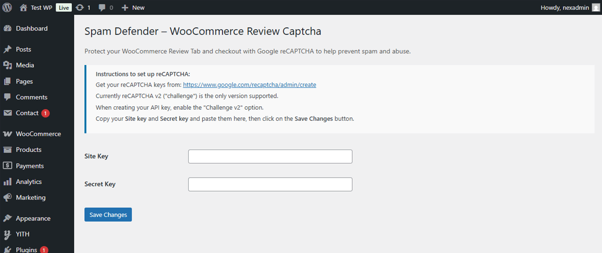
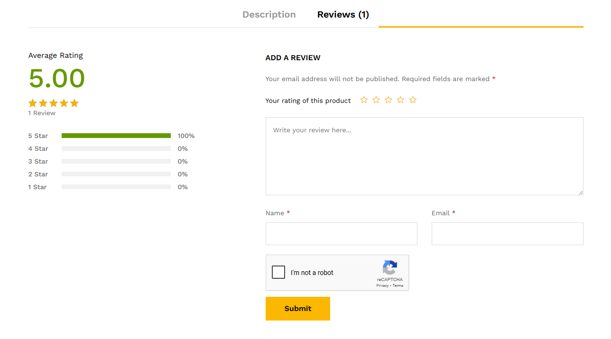
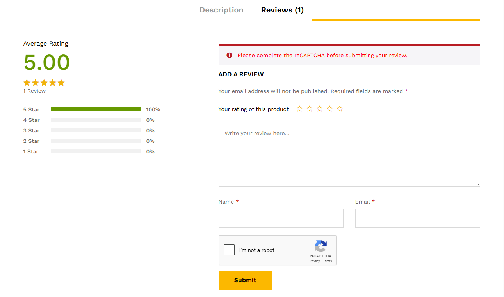

# 🚫 Spam Defender – Review Captcha for WooCommerce

Add captcha to WooCommerce product reviews. Prevent spam reviews and ensure only real customers can submit reviews.
---

## 📌 Plugin Information
- **Contributors:** shagor447  
- **Tags:** spam, captcha, reviews, woocommerce, security  
- **Requires at least:** WordPress 4.8  
- **Tested up to:** WordPress 6.8  
- **Requires PHP:** 7.0  
- **Stable tag:** 1.0.1 
- **License:** [GPLv2 or later](https://www.gnu.org/licenses/gpl-2.0.html)  

---

## 📖 Description
**Spam Defender – Review Captcha for WooCommerce** helps you reduce spam product reviews by adding a captcha verification before review submission.  
This plugin provides a simple but effective solution to keep your product reviews section clean and trustworthy.
---

## ✨ Features
- Adds captcha to WooCommerce product review forms.
- Blocks spam bots from auto-submitting fake reviews.
- Lightweight and easy to use.
- No coding knowledge required.
- Compatible with latest versions of WordPress and WooCommerce. 

---

## ⚙️ Installation
1. Upload the `spam-defender-review-captcha-for-woocommerce` directory to the `/wp-content/plugins/` directory.
2. Activate the plugin through the ‘Plugins’ menu in WordPress.
3. Navigate to **Dashboard > Settings > Woocommerce Review Captcha** and click to configure reCaptcha API setup.

---

## ❓ Frequently Asked Questions

### 🔹 Does this work only with WooCommerce reviews?
Yes, this plugin specifically adds captcha to WooCommerce product review forms.  

### 🔹 Do I need to configure anything?
Yes, once activated, you’ll need to enter your reCAPTCHA API credentials to complete the setup.  

### 🔹 Is it compatible with other captcha plugins?
This plugin is specifically designed for WooCommerce product reviews. However, if you use another plugin for the same purpose, it may cause conflicts.

### 🔹 Will it affect site performance?
No, the plugin is lightweight and optimized for speed.

---

## 🖼️ Screenshots
1. reCAPTCHA API credentials configure page. 
2. Captcha displayed in WooCommerce product review form. 
3. Error message shown if captcha is not solved. 

---

## 📝 Changelog

### 1.0.1
- Initial release.
- Added captcha to WooCommerce product review form.
- Prevents review submission without solving captcha.

---

## 📢 Update Notice
= 1.0.1 =
First stable release – adds captcha protection to WooCommerce product reviews.

## ⚖️ License & Copyright
- Copyright © **Raisul Islam Shagor** 
- Email: deploy@raisul.dev
- Website: https://raisul.dev/
- Conatct: https://raisul.dev/contact
